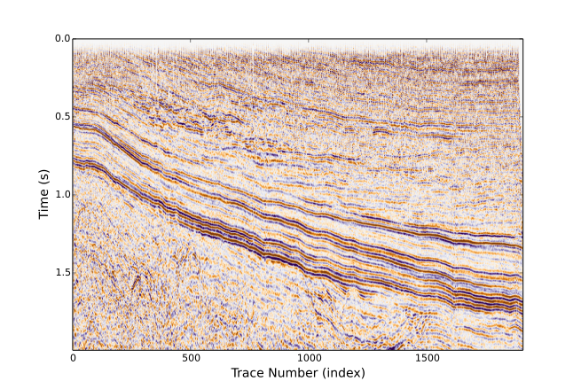

<a id='ReadWrite-1'></a>

# ReadWrite


Seismic.jl provides seismic data reading, writing and plotting. Currently, The conversions between .seis data format and .segy, .su and madagascar data format, bellow we give a simple example about converting SEGY data format to our internal data format.


<a id='Example-1'></a>

## Example


```julia
using PyPlot, Seismic,Compat
download("http://certmapper.cr.usgs.gov/nersl/NPRA/seismic/1979/616_79/PROCESSED/616_79_PR.SGY", "616_79_PR.SGY");
SegyToSeis("616_79_PR.SGY", "616_79_PR.seis");
d, h, e = SeisRead("616_79_PR.seis");
SeisPlot(d[1:500, :], e, cmap="PuOr", wbox=9);
```

```
  % Total    % Received % Xferd  Average Speed   Time    Time     Time  Current
                                 Dload  Upload   Total   Spent    Left  Speed

  0     0    0     0    0     0      0      0 --:--:-- --:--:-- --:--:--     0
  0     0    0     0    0     0      0      0 --:--:-- --:--:-- --:--:--     0

  0     0    0     0    0     0      0      0 --:--:-- --:--:-- --:--:--     0
  3 11.3M    3  416k    0     0   280k      0  0:00:41  0:00:01  0:00:40  410k
 55 11.3M   55 6416k    0     0  2650k      0  0:00:04  0:00:02  0:00:02 3288k
100 11.3M  100 11.3M    0     0  3984k      0  0:00:02  0:00:02 --:--:-- 4750k
number of traces: 1908
number of samples per trace: 1500
```


In above example, we first download the data from USGS's website, then convert the data from SEGY data format to our internal format, finally the data are plotted. 

